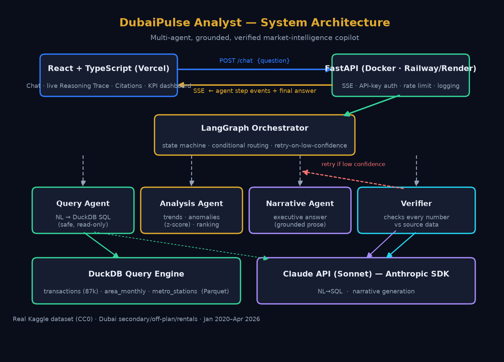

<div align="center">

# 🏙️ DubaiPulse Analyst

**An agentic AI market-intelligence copilot for Dubai real estate — not a chatbot over a spreadsheet.**

It *investigates* why prices and volumes moved, *cites* the data behind every answer, and *verifies*
every number against the source before showing it to you.

[](https://github.com/krish2105/Dubai-Pulse-Analyst-/actions/workflows/ci.yml)


</div>

---

## 1. Problem statement — and why it matters

Dubai's residential market is one of the most dynamic in the world: a COVID-19 dip in 2020, the
Expo 2020 rally, a wave of post-2022 capital inflows, the October 2022 Golden Visa expansion, and a
2024–25 cooling. Buyers, analysts and PropTech teams constantly ask *"what happened, and why?"*.

The usual "ask-a-chatbot-about-a-CSV" answer to this is **not trustworthy**: LLMs happily invent
plausible-but-wrong numbers, and they hide their reasoning. For anything resembling an investment or
business decision, that's a non-starter.

**DubaiPulse Analyst** is built the way a production AI system should be:

- an **orchestrator + specialist agents** (query → analysis → narrative → verify), not one prompt;
- a **Verifier** that checks *every number* in the answer against the actual queried data — and flags
  low-confidence answers instead of presenting guesses as fact;
- a **live, streamed reasoning trace** so you can watch the investigation happen;
- a modern **React + FastAPI** production stack (not a Streamlit demo).

It's a portfolio project designed to demonstrate real *production instincts* for **AI Business Analyst**,
**Agentic AI Engineer**, and **GenAI / Data Science (PropTech / FinTech)** roles.

---

## 2. What makes it different (the standout features)

| Feature | Why it matters |
|--------|----------------|
| 🧠 **Multi-agent orchestration (LangGraph)** | An explicit state machine with conditional routing (skip analysis for simple lookups) and a retry path — not a single mega-prompt. |
| 🛡️ **Deterministic Verifier** | Extracts every numeric claim from the answer and matches it against the queried data + computed metrics. It does **not** ask the LLM to "double-check itself". |
| 📡 **Live reasoning trace (SSE)** | Every agent step streams to the UI in real time, with the SQL, row counts, facts and verification result. |
| 🔎 **Grounded citations** | Each answer carries row count, date range, filters, tables and the exact SQL that produced it. |
| ⚠️ **Honest low-confidence flag** | If the numbers can't be confirmed, the answer is visibly flagged — never silently presented as fact. |
| 🧾 **Safe NL→SQL** | The LLM proposes SQL; a deterministic engine enforces read-only, single-statement, row-capped execution. |

---

## 3. Architecture



```
React (Vercel) ──POST /chat──▶ FastAPI (Docker · Railway/Render)
     ▲   └───────── SSE ◀──────────┘        │
     │  step events + final answer          ▼
     │                          LangGraph Orchestrator
   live trace                    ├─ Query Agent     → NL → DuckDB SQL → data
   + answer                      ├─ Analysis Agent  → trends / anomalies / ranking (deterministic)
   + citations                   ├─ Narrative Agent → executive answer, grounded in facts
                                 └─ Verifier        → every number checked vs source data
                                        │ low confidence → retry once, else finalize
                                        ▼
                        DuckDB over Parquet  ·  Claude (Sonnet) via Anthropic SDK
```

**Design decisions worth defending in an interview** (see the [Viva Q&A](#11-viva--interview-qa)):
routing is deterministic and testable; the Analysis Agent and Verifier are pure Python (so the numbers
provably come from the data); the LLM is dependency-injected, so the whole orchestrator is tested with
**no API key and no network**.

---

## 4. Tech stack

| Layer | Choice |
|-------|--------|
| Frontend | React + TypeScript + Vite, Tailwind CSS, React Query, Recharts |
| Streaming | Server-Sent Events (POST + `fetch` stream reader) |
| Backend | FastAPI (async), sse-starlette |
| Orchestration | LangGraph (state machine) |
| Data engine | DuckDB over Parquet |
| LLM | Claude (Sonnet) via the Anthropic SDK |
| Auth / limits | `X-API-Key` middleware · slowapi rate limiting |
| Container / CI | Docker · GitHub Actions (ruff + pytest + eslint + build) |
| Hosting | Frontend → Vercel · Backend → Railway / Render |

---

## 5. Dataset

- **Source:** [Dubai Real Estate: Sales, Off-Plan & Rentals (2020–2026)](https://www.kaggle.com/datasets/sergionefedov/dubai-real-estate-sales-and-rentals-20202026) on Kaggle.
- **License:** CC0 1.0 (public domain).
- **Coverage:** Jan 2020 → Apr 2026 · **84 communities** · **52 zones** · **87,000** listing-level records
  (50k secondary sales, 12k off-plan, 25k rentals) + 6,384 monthly community aggregates + 55 metro stations.
- Combines **real anchors** (community coordinates, Dubai Metro, the CBUAE base-rate timeline, DLD /
  Property Finder base prices) with a **hedonic pricing model** for listing-level attributes. All prices in USD.

### ⚠️ Known limitations (stated up front — the app surfaces these, it doesn't hide them)

1. Coordinates are **jittered** around community centroids (not exact addresses).
2. **No service-charge field** → all rental **yields are gross**, not net.
3. Listing-level attributes are **hedonic-model outputs** calibrated to real base prices, not individual DLD records.
4. No micro-amenity features beyond metro distance.

Full column-by-column documentation: **[`backend/data/data_dictionary.md`](backend/data/data_dictionary.md)**.

---

## 6. Run it locally

### Prerequisites
Python 3.12+, Node 20+, and an [Anthropic API key](https://console.anthropic.com/) (for live answers).

### Backend

```bash
cd backend
python -m venv .venv && source .venv/bin/activate
pip install -r requirements.txt

cp .env.example .env            # then paste your ANTHROPIC_API_KEY into .env

python -m app.data_pipeline     # builds data/processed/*.parquet from the raw CSVs
uvicorn app.main:app --reload   # → http://localhost:8000  (docs at /docs)
```

Sanity check: `curl http://localhost:8000/health` → `{"status":"ok", ...}`.

### Frontend

```bash
cd frontend
npm install
cp .env.example .env.local      # leave VITE_API_BASE_URL blank to use the Vite dev proxy
npm run dev                     # → http://localhost:5173
```

### With Docker (backend)

```bash
ANTHROPIC_API_KEY=sk-ant-... docker compose up --build   # backend on :8000
```

### Run the tests

```bash
cd backend && pytest -q                    # 26 tests, no API key required
ruff check app tests                       # backend lint
cd ../frontend && npm run lint && npm run build   # frontend lint + typecheck + build
```

The test suite injects a **stub LLM**, so it exercises the entire orchestrator (routing, real DuckDB
execution, the analysis math, and the Verifier — including the hallucination-triggers-retry path)
completely offline.

---

## 7. Live demo

- **Frontend:** _<add Vercel URL after deploy>_
- **Backend health:** _<add Railway/Render URL>_`/health`
- **Walkthrough video:** see [`docs/demo_video_link.md`](docs/demo_video_link.md).

See **[`DEPLOYMENT.md`](DEPLOYMENT.md)** for step-by-step Vercel + Railway/Render instructions.

---

## 8. Example questions & outputs

Try these (also the evaluation benchmark — see [`evaluation/eval_questions.md`](evaluation/eval_questions.md)):

- *Which zones saw the biggest price increase in 2024?*
- *Compare rental yields across Downtown Dubai and Dubai Marina in 2025.*
- *Why did off-plan transaction volume change in early 2022?*
- *What is the average price per sqft in Palm Jumeirah for secondary sales in 2025?*
- *How did the CBUAE base rate relate to secondary price growth from 2022 to 2024?*

**Example (grounded, verified):**

> **Q:** *Compare rental yields across Downtown Dubai and Dubai Marina in 2025.*
>
> **A:** Dubai Marina edged out Downtown Dubai on gross rental yield in 2025 — **6.51%** vs **6.49%**,
> a negligible gap. *Note: gross yields (service charges excluded).*
>
> `✅ Verified 2/2 · high confidence` · Source: 2 rows · `area_monthly` · filters: rental yield, 2025,
> Downtown Dubai vs Dubai Marina · **[View SQL]**

When a figure can't be confirmed, the answer is regenerated once, then shown with a **low-confidence** badge.

---

## 9. Evaluation approach & results

We evaluate **behaviour and grounding**, not exact wording (LLM phrasing varies). Each benchmark
question is scored on five criteria — *Grounded, Routed correctly, Cited, Honest, Confidence-flagged* —
with **Grounded mandatory** (see the rubric in [`evaluation/eval_questions.md`](evaluation/eval_questions.md)).

Automated tests (`backend/tests/test_agents.py`, **26 passing**) assert:

- ✅ SQL safety — every non-read-only / chained statement is rejected; row cap enforced.
- ✅ Routing — analytical questions invoke the Analysis Agent; simple lookups skip it.
- ✅ Analysis — trend %, ranking, and z-score anomaly detection on known series.
- ✅ Verifier — grounded answers verify high; a hallucinated figure is flagged low and **triggers a retry**.
- ✅ API — `/health`, `/insights`, `/chat` (SSE) behave and validate input.

---

## 10. Limitations & known failure modes (honest by design)

- **Gross yields only** (no service charges) — headline yields are optimistic vs realised net yields.
- **Hedonic listing attributes** — realistic and internally consistent, but not individual DLD transactions.
- **Correlation ≠ causation** — "why" answers surface correlations (e.g. base-rate vs price) and say so.
- **NL→SQL edge cases** — very ambiguous questions may pick the closest valid filter; the Verifier's
  low-confidence flag and the visible SQL are the safety net.
- **Free-tier cold starts** — a hosted backend on a free plan may take a few seconds to wake.

---

## 11. Future improvements

- Human-in-the-loop approval before any recommendation is surfaced.
- Arabic-language question support (bilingual UAE market).
- A net-yield model once service-charge data is available.
- Retrieval over DLD press releases / policy notes to strengthen "why" answers with real citations.
- Per-user history + saved investigations; export to PDF.

---

## 12. Viva / interview Q&A

<details>
<summary><b>Why multiple agents instead of one big prompt?</b></summary>

Separation of concerns and *verifiability*. The Analysis Agent and Verifier are deterministic Python,
so the numbers provably come from the data. The LLM is confined to two well-scoped jobs (NL→SQL and
prose), each independently testable. One mega-prompt would be neither auditable nor safely verifiable.
</details>

<details>
<summary><b>How does the Verifier actually work? Isn't it just another LLM call?</b></summary>

No — that's the whole point. It's deterministic: it extracts every numeric token from the answer and
matches each against the set of numbers that provably come from the data (every cell of the query
result, plus the computed KPIs/trend/ranking figures), within a small rounding tolerance. Years and
small structural integers ("top 5") are treated as references. If too few figures match, the answer is
flagged low-confidence and regenerated once with corrective feedback.
</details>

<details>
<summary><b>Why is the SQL safe if an LLM writes it?</b></summary>

The LLM only *proposes* SQL. The DuckDB engine validates it (single statement, must start with
SELECT/WITH, forbidden-keyword blocklist), wraps it with a hard row cap, and runs it against read-only
Parquet views. Non-read-only or chained statements are rejected before execution.
</details>

<details>
<summary><b>How is streaming implemented?</b></summary>

Agent steps are emitted through a context-local event stream (so LangGraph state stays clean and
serialisable). The `/chat` route runs the orchestrator in a task and drains that stream to the client
as Server-Sent Events. The frontend POSTs and reads the `fetch` response body as a stream (EventSource
can't POST), parsing SSE frames into live UI updates.
</details>

<details>
<summary><b>How did you test agents when output is non-deterministic?</b></summary>

The LLM is dependency-injected. Tests pass a stub that returns canned SQL/prose, so the deterministic
scaffolding — routing, DuckDB execution, analysis math, verification, and the retry loop — is asserted
exactly, with no API key or network. LLM-phrasing is never asserted verbatim.
</details>

<details>
<summary><b>Why DuckDB + Parquet instead of a database server?</b></summary>

The data is read-only and modest in size. DuckDB gives full analytical SQL over Parquet in-process,
with zero infrastructure — ideal for a fast, portable, containerised analytics service.
</details>

---

## 13. Repository layout

```
├── backend/            FastAPI + LangGraph agents + DuckDB
│   ├── app/
│   │   ├── agents/     orchestrator, query, analysis, narrative, verifier, events
│   │   ├── api/routes/ chat (SSE), health, insights
│   │   ├── tools/      duckdb_engine, llm client
│   │   ├── data_pipeline.py, config.py, middleware.py, rate_limit.py, main.py
│   │   └── data/       raw CSVs · processed Parquet · data_dictionary.md
│   ├── tests/          test_agents.py (26 tests)
│   └── Dockerfile
├── frontend/           React + TS + Vite + Tailwind
│   └── src/            components (ChatWindow, ReasoningTracePanel, SourceCitation, KpiDashboard…),
│                       hooks/useAgentStream, lib/api
├── evaluation/         eval_questions.md (benchmark + KPIs + rubric)
├── docs/               architecture_diagram.png, demo_video_link.md
├── .github/workflows/  ci.yml
├── docker-compose.yml · render.yaml · DEPLOYMENT.md
```

---

<div align="center">
Built to demonstrate production-grade agentic AI engineering for the UAE market.
<br/>Data: Kaggle (CC0). Code: MIT.
</div>
